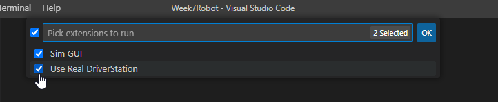
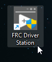
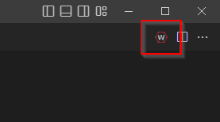
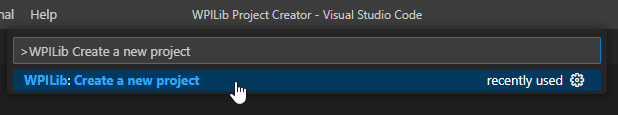

---

layout: default
title: Exploring the WPILib Framework
parent: Introduction to the WPILib Framework
nav_order: 1

---

# Exploring the WPILib Framework

WPILib, short for FIRST Robotics Competition Software (FRC), is a library that enables teams to write their robot code in Java or C++. It includes classes to handle basic robotics programming tasks and interfaces for hardware components, making it much easier to program a competitive robot.

The WPILib suite is an impressive collection of libraries, tools, and utilities to help teams develop their robot software. Some of its features include motor control libraries, sensor interfaces, networking features, and even simulation capabilities.

## Why use WPILib?

The main advantage of using WPILib is that it abstracts the complexity of the hardware and low-level programming tasks. This allows teams to focus more on implementing the robot's behavior and less on the specifics of how the hardware works. It also provides a common framework that is used by many teams, which makes sharing code and getting help from the community much easier.

## How to use WPILib

The typical way to use WPILib in a robot program is to extend one of its base classes and override methods to specify the robot's behavior. The `Command Robot` class is the most commonly used base class. It provides a simple main loop that is called every 20 milliseconds and callback methods for different stages of the competition (like autonomous or teleoperated mode).

Here's a simple example of a robot program using `CommandRobot`:

    package frc.robot;

    import edu.wpi.first.wpilibj.TimedRobot;
    import edu.wpi.first.wpilibj2.command.Command;
    import edu.wpi.first.wpilibj2.command.CommandScheduler;
    
    public class Robot extends TimedRobot {
        private RobotContainer m_robotContainer;

        @Override
        public void robotInit() {
            m_robotContainer = new RobotContainer();
        } 

        @Override
        public void robotPeriodic() {
            CommandScheduler.getInstance().run();
        }

        @Override
        public void disabledInit() {}

        @Override
        public void disabledPeriodic() {}

        @Override
        public void autonomousInit() {}

        @Override
        public void autonomousPeriodic() {}

        @Override
        public void teleopInit() {}

        @Override
        public void teleopPeriodic() {}

    }

In `teleopInit()`, we initialize the state of the robot for the teleoperated period. This could involve resetting sensors, setting initial motor speeds, or other preparation tasks. The `teleopInit()` method is called once each time the robot enters the teleoperated mode.

In `teleopPeriodic()`, we control the robot's behavior during the teleoperated period. This method is called approximately every 20ms (or 50 times per second) during the teleoperated period. Typically, code in this method will read inputs from joystick or other controls, and use those inputs to control motors and other outputs.

Here's an example of how you might use these methods to drive a robot with a joystick:

    import edu.wpi.first.wpilibj.TimedRobot;
    import edu.wpi.first.wpilibj.XboxController;
    import edu.wpi.first.wpilibj2.command.Command;
    import edu.wpi.first.wpilibj2.command.CommandScheduler;

    public class Robot extends TimedRobot {
        private XboxController driveController = new XboxController(0);

        @Override
        public void teleopInit() {
        }

        @Override
        public void teleopPeriodic() {
            // Print the current left stick Y-axis position to the console
            System.out.println("Left stick Y position: " + driveController.getLeftY());

            // Check if A or B button is pressed print to the screen
            if (driveController.getAButton()) {
                System.out.println("A button is currently pressed.");
            }
            if (driveController.getBButton()) {
                System.out.println("B button is currently pressed.");
            }   
        }
    }

In the `teleopPeriodic()` method, I added checks to see if the A or B button on the Xbox controller is pressed using `controller.getAButton()` and `controller.getBButton()`. Every periodic while button is pressed, a message prints to the console.

## Running a Build in WPILib VS Code
WPILib offers a comprehensive set of tools for building and deploying code on FRC robots, with integration into Visual Studio Code. To run a build in WPILib VS Code, follow these steps:
1. **Open Your Project:** Navigate to the WPILib project in VS Code by choosing File > Open Folder and selecting the folder where your project resides.
2. **Build Your Project:** Click on the WPI icon on the upper right hand side of the VS Code window. In the command palette that appears, type "WPILib: Build Robot Code" and select it.
3. **Deploying Code:** To deploy code to your robot, use the command "WPILib: Deploy Robot Code". Ensure your roboRIO is connected to your development machine either by USB or through the network. VS Code will compile your code and upload the resulting executable to the roboRIO.

## Simulating Robot Code
The WPILib project supports a robot simulation GUI, which allows teams to test their robot code without a physical robot. This feature is extremely useful for testing code changes quickly and debugging potential issues.

To run the simulator, follow these steps:
1. **Open Your Project:** As with the previous sections, open your project in Visual Studio Code.
2. **Run the Simulator:** Click on the WPI icon on the upper right hand side of the VS Code window. In the command palette that appears, type "WPILib: Simulate Robot Code" and select it.
3. **Pick Extensions:** In the next window "Pick extensions to run" select both Sim GUI and Use Real Driverstation.

4. **Open FRC Driver Station:** If using a Windows machine, open the FRC Driver station from your desktop. The application should automatically connect to the simulator.

5. **Interact with the Simulator:** The simulator window will open, showing various options for controlling and observing your simulated robot. These options can simulate different parts of your robot, like motors, encoders, gyroscopes and so on. This enables you to test how your code interacts with these components. For example, you can simulate pressing buttons on your joystick or Xbox controller to see how your robot code reacts.
6. **Stop the Simulator:** When you're done with testing, you can stop the simulator by clicking the "stop" button on the toolbar in VS Code (or Ctrl + F5).

# Tasks
1. Create a new robot project
* Click the WPILib button in the right-hand corner

* In the drop-down menu, filter to "WPILib: Create a new project" and click enter.

* Click "Select a project type (Example or Template)".
* Choose "Template".
* Select "Java".
* Click "Command Robot".
* For the "Base Folder", select your Desktop or wherever you are storing your projects. Enter the project name as "WhackAMole". Ensure "Create a new folder" is checked.
* For the team number, enter 7617.
* Click the checkbox for "Enable Desktop Support".
* Lastly, click "Generate Project".
2. **Explore the Generated Code:** Spend some time understanding the generated code. Each part is there for a reason and has a specific purpose. If there are parts that are confusing, use the WPILib documentation or other resources to help you understand it better.
3. **Modify the Robot Code:** In the teleop period, make the robot do something different. 
* Interact with the controller to print details to the terminal when each button is pressed. This could be as simple as printing a different message for each button, or it could be something more complex depending on your understanding and creativity.

Remember, the goal here is to familiarize yourself with WPILib and understand how to create and modify a robot project. Don't worry if you don't understand everything right away. Take your time and don't be afraid to experiment.

